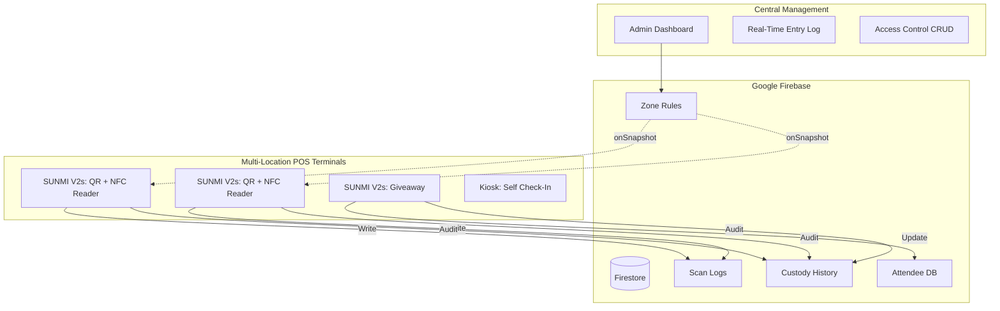
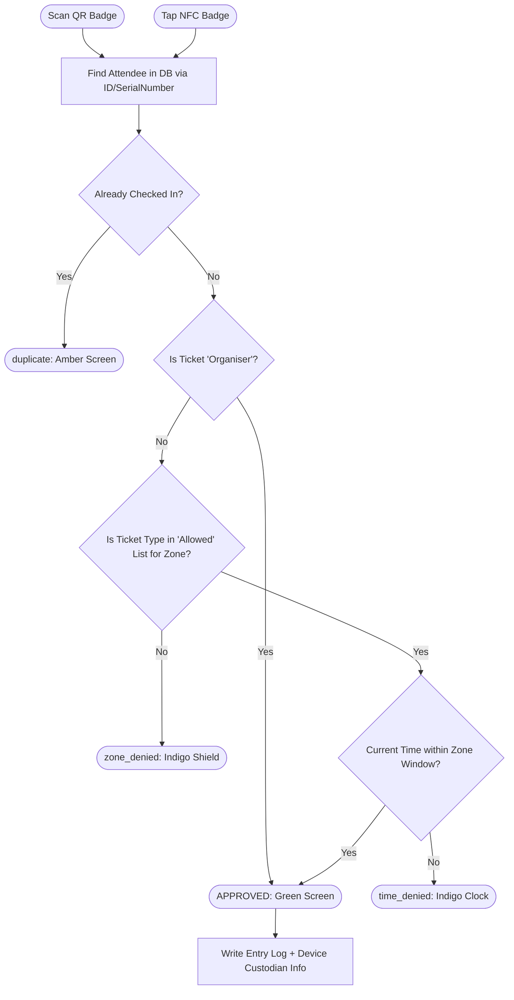

# EventPro System Architecture & Flow Map

This document provides a visual and technical overview of the complete EventPro multi-location ecosystem.

---

## 1. System Architecture
The platform is built on a distributed terminal model, syncing in real-time via Firebase Firestore.

---

## 2. Access Control Logic Flow (Hybrid QR + NFC)
How the system decides whether to grant or deny entry.

---

## 3. Device Custody & Staff Accountability
The 3-Step Login flow for terminal hardware.

| Step | Action | Visibility | Data Point Collected |
|---|---|---|---|
| **1. PIN** | Staff enters device PIN | Private | `deviceId` linkage |
| **2. ID** | Staff enters Name/Designation | Admin Only | `holderName` |
| **3. Bio** | Selfie Capture (Front Camera) | Admin Only | `hasPhoto` flag + base64 |
| **Login** | Terminal locks to assigned gate | System | `loginTime` |

---

## 4. Database Schema (Firestore)

### `zoneRules`
- `gateId`: (string) e.g., `vip-lounge`
- `gateName`: (string) e.g., "VIP Lounge"
- `allowedTickets`: (array) e.g., `['vip', 'speaker']`
- `timeWindow`: `{ always: bool, start: "HH:mm", end: "HH:mm" }`

### `scanLogs`
- `attendeeName`: (string)
- `ticketType`: (string)
- `gateName`: (string)
- `result`: `approved` | `zone_denied` | `time_denied` | `duplicate`
- `deviceName`: (string)
- `holderName`: (string)
- `timestamp`: (serverTimestamp)

### `devices`
- `pin`: (string)
- `currentHolder`: `{ name, photo, loginTime }`
- `custodyHistory`: (array of previous holders with `logoutTime`)

---

## 5. Visual Movement Reconstruction
Clicking an attendee in the **Entry Log** activates the journey reconstruction engine:
1.  **Filter**: Searches `scanLogs` for matches on `attendeeId`.
2.  **Sort**: Orders entries by `timestamp` (ASC).
3.  **Map**: Draws a vertical timeline connecting locations.
4.  **Audit**: Highlights gaps in movement (e.g., missed arrival at Main Entrance).

---

*Generated by EventPro System Architect*
